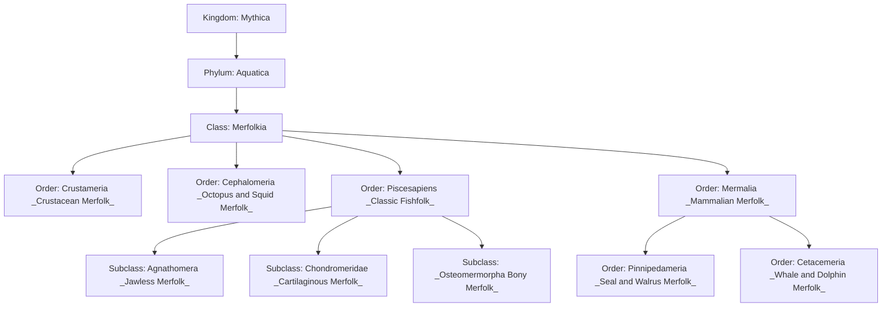

# Merfolk Taxonomy

```mermaid
flowchart TD
A["Kingdom: Mythica"] --> B["Phylum: Aquatica"]
  B --> C["Class: Merfolkia"]

  C --> D["Order: Crustameria _Crustacean Merfolk_"]
  
  C --> F["Order: Cephalomeria _Octopus and Squid Merfolk_"]
  C --> G["Order: Piscesapiens _Classic Fishfolk_"]
  C --> H["Order: Mermalia _Mammalian Merfolk_"]

  H --> H1["Order: Pinnipedameria _Seal and Walrus Merfolk_"]
  H --> H2["Order: Cetacemeria _Whale and Dolphin Merfolk_"]

  G --> G1["Subclass: Agnathomera _Jawless Merfolk_"]
  G --> G2["Subclass: Chondromeridae _Cartilaginous Merfolk_"]
  G --> G3["Subclass: _Osteomermorpha Bony Merfolk_"]
```

You wanted a mermaid diagram, you got one. Behold, the top-down flow chart featuring taxonomy of merfolk. 
This is based off of marine life classification. 
